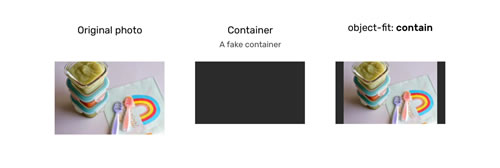
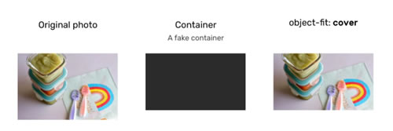
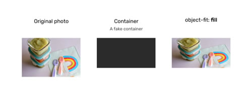

## 类数组

```javascript
var a = {'1':'gg','2':'love','4':'meimei',length:5};
```


## CSS

`object-fit`属性指定[可替换元素](https://developer.mozilla.org/zh-CN/docs/Web/CSS/Replaced_element)（例如：`img` 或 `video`）的内容应该如何适应该元素的尺寸，它可以取以下几个值

- `contain`：

  

- `cover`：图像也将被调整大小以适应其容器的纵横比，如果图像的纵横比与容器的不匹配，那么它将被裁剪以适应。

  

- `fill`：图像将被调整大小以适应其容器的纵横比，如果图像的纵横比与容器的不匹配，它将被挤压或拉伸。

  

- `none`：图像根本不会调整大小，既不会拉伸也不会压缩

该`object-position`属性的工作方式类似于 `background-position`属性。

## 数据类型

简写属性：

~~~JavaScript
function makeUser(name, age) {
  return {
    name, // 与 name: name 相同
    age,  // 与 age: age 相同
    // ...
  };
}
~~~


WeakMap 不会阻止垃圾回收机制对作为键的对象（key object）的回收。 `WeakMap` 不支持迭代以及 `keys()`，`values()` 和 `entries()` 方法。它只支持以下的方法：

- `weakMap.get(key)`
- `weakMap.set(key, value)`
- `weakMap.delete(key)`
- `weakMap.has(key)`

通过下面这个例子来解释这一点：

~~~js
let john = { name: "John" };

let weakMap = new WeakMap();
weakMap.set(john, "...");

john = null; 
~~~

weakMap 并不知道 john 何时被回收（赋值为 null），所以从技术上讲，`WeakMap` 的当前元素的数量是未知的，故而禁止访问 WekMap `keys()` 等方法。

它的主要应用场景是**额外数据的存储**，例如，我们会使用第三方库中的对象，并且要存储一些与之相关的数据，理所应当地，这些数据要与这个对象共存亡，这时候 `WeakMap` 正是我们所需要的利器。下面我们通过一个例子来理解这一点：

~~~JavaScript
let visitsCountMap = new WeakMap();
// 统计用户的访问次数
function countUser(user) {
  let count = visitsCountMap.get(user) || 0;
  visitsCountMap.set(user, count + 1);
}
~~~

~~~JavaScript
let john = { name: "John" };
countUser(john); // count his visits

// 不久之后，用户离开了，与它相关联的访问次数也要被清理
// 如果使用 new Map()，那么它的访问次数就一直保留在 Map 中，必须要手动做一些清理工作。
john = null;
~~~


`WeakSet` 的表现与 WeakMap 类似，只支持 `add`，`has` 和 `delete` 方法，但不支持 `size` 和 `keys()`，并且不可迭代。


`map.entries()` —— 遍历并返回一个包含所有实体 `[key, value]` 的可迭代对象，`for..of` 在默认情况下使用的就是这个。

~~~JavaScript
// 遍历所有的实体 [key, value]
for (let entry of recipeMap) { // 与 recipeMap.entries() 相同
  alert(entry); 
}
~~~


对于普通对象，下列这些方法是可用的：

- Object.keys(obj) ：返回一个包含该对象所有的键的数组。
- Object.values(obj)：返回一个包含该对象所有的值的数组。
- Object.entries(obj) ：返回一个包含该对象所有 [key, value] 键值对的数组。

>注意，map.keys() 返回的是一个可迭代对象，而 Object.keys 返回的是一个数组

就像 `for..in` 循环一样，这些方法会忽略使用 `Symbol(...)` 作为键的属性。但是，如果我们也想要 Symbol 类型的键，那么我们可以使用 `Object.getOwnPropertySymbols` ，它仅返回包含 Symbol 类型的键的数组。

我们可以使用 `Object.fromEntries` 从一个数组来构建新的对象，一般像下面这个例子一样使用：

~~~JavaScript
let prices = {
  banana: 1,
  orange: 2,
  meat: 4,
};

let doublePrices = Object.fromEntries(
  // 将价格转换为数组，将每个键/值对映射为另一对
  // 然后通过 fromEntries 再将结果转换为对象
  Object.entries(prices).map(entry => [entry[0], entry[1] * 2])
);

alert(doublePrices.meat); // 8
~~~


我们可以通过 **解构赋值** 这个特性，将将数组、可迭代对象、对象「拆包」至一系列变量中。

~~~JavaScript
let arr = ["John", "Smith"]

// 解构赋值，设置 firstName = arr[0]，以及 surname = arr[1]
let [firstName, surname] = arr;
~~~

可以通过添加额外的逗号，来丢弃数组中不想要的元素：

~~~JavaScript
let [firstName, , title] = ["Julius", "Caesar", "Consul", "of the Roman Republic"];
~~~

我们可以使用在解构赋值的最后一个参数位置的 `...` ，来接收剩余所有的数组元素：

~~~Javascript
let [name1, name2, ...rest] = ["Julius", "Caesar", "Consul", "of the Roman Republic"];

alert(rest[0]); // Consul
alert(rest[1]); // of the Roman Republic
alert(rest.length); // 2
~~~

如果数组比变量列表短，缺少对应值的变量都会被赋 `undefined`。但我们可以给未赋值的变量设置一个默认值：

~~~JavaScript
let [name = "Guest", surname = "Anonymous"] = ["Julius"];
~~~

默认值甚至可以是函数调用。它们只有在对应变量未被赋值的时候才会被计算。


对象解构的语法：将对象属性解构到多个变量中（不是解构到一个对象中）

~~~JavaScript
let {var1, var2} = {var1:…, var2:…}
~~~

~~~JavaScript
let options = {
  title: "Menu",
  width: 100,
  height: 200
};

// 同名属性进行赋值，注意这里并不是声明了一个对象，而是分别声明了三个变量
let {title, width, height} = options;

// 指定属性名之间的映射关系
// { sourceProperty: targetVariable }
let {width: w, height: h, title} = options;
~~~

对于可能缺失的属性，我们可以设置默认值。默认值可以是任意表达式，它们只会在未提供对应的值时才会被计算。

~~~JavaScript
let {width = 100, height = 200, title} = options;
let {width: w = 100, height: h = 200, title} = options;
~~~

此外，我们也可以通过 `...` 来接收多余的对象属性：
~~~Javascript
let {title, ...rest} = options;
~~~


如果一个对象或数组嵌套了其他的对象和数组，我们可以在等号左侧使用更复杂的模式（pattern）来提取更深层的数据。

~~~JavaScript
let options = {
  size: {
    width: 100,
    height: 200
  },
  items: ["Cake", "Donut"],
  extra: true
};

// 为了清晰起见，解构赋值语句被写成多行的形式
let {
  size: { // 把 size 赋值到这里
    width,
    height
  },
  items: [item1, item2], // 把 items 赋值到这里
  title = "Menu" // 在对象中不存在（使用默认值）
} = options;
~~~


我们可以使用该「解构赋值」来实现通过命名来传递参数的特性：

~~~JavaScript
// 我们传递一个对象给函数
let options = {
  title: "My menu",
  items: ["Item1", "Item2"]
};

// ……然后函数马上把对象解构成变量
function showMenu({title = "Untitled", width = 200, height = 100, items = []}) {}

showMenu(options);
~~~


- new Date()
- new Date(milliseconds)：创建一个 `Date` 对象，其时间等于 1970 年 1 月 1 日 UTC+0 之后经过的毫秒数
- new Date(datestring)：

