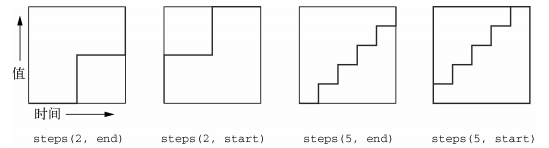

- `:empty`：匹配没有子元素的元素。注意，如果元素包含空格就无法被匹配到，因为空格在 DOM 中属于文本节点。

- `:nth-child(an+b)`：匹配在兄弟元素中满足条件所指定的位置的元素

- `:nth-last-child(an+b)`

- `:first-of-type`：与`:first-child`类似，但是选择一组兄弟元素中同类型的第一个元素

  ~~~css
  /* 多个 p 元素作为兄弟，选择第一个 p 元素*/
  p:first-of-type {
      color: red;
      font-style: italic;
  }
  
  /* 在 article 中，选择每种类型的第一个元素并设置背景色为粉色 */
  article :first-of-type {
  	background-color: pink;
  }
  ~~~

  

### 阴影

如果没有指定`inset`，默认阴影在边框外，即阴影向外扩散。 使用 `inset` 关键字会使得阴影落在盒子内部。

### 混合

background-image 可以接收任意数量的值。在使用多个背景图片时，在参数列表中排在前面的图片，会渲染到排序靠后图片的上面。

~~~css
background-image: url(bear.jpg), linear-gradient(to bottom, #57b, #148);
~~~

相应地，大部分背景相关的属性（background-size 等）也可以接受多个值。此时，第一个值会应用到第一张背景图片上，第二个值会应用到第二张背景图片上。如果只提供一个值，那么就应用到所有背景图片上。

background-blend-mode 可以将多个图片（background-image）或者颜色（background-color）进行混合。CSS 支持 15 种混合模式。

### 字体

一般字体网站都提供一份字体样式表，我们直接在我们文档中 link 即可使用该字体：

~~~html
<link href="https://fonts.googleapis.com/css?family=Roboto:300|Sansita:800"
 rel="stylesheet">
~~~

~~~css
h1, h2, h3, h4 {
	font-family: Sansita, serif;			/* 使用该字体 */
}
~~~

这是通过 @font-face 来实现的：

~~~css
@font-face {
    /* 声明字体的名称 */
    font-family: 'Roboto';
    /* 在指定 style 以及 weight 下使用该字体 */
    font-style: normal;
    font-weight: 300;
    /* 指定字体文件的来源，从前往后依次尝试加载字体，直到加载成功  */
    src: local('Roboto Light'), local('Roboto-Light'),
        url(https://fonts.gstatic.com/s/roboto/v15/Hgo13k- 
            tfSpn0qi1SFdUfZBw1xU1rKptJj_0jans920.woff2) format('woff2');
    
    /* 在以下 Unicode 编码的范围中，使用该字体 */
    unicode-range: U+0000-00FF, U+0131, U+0152-0153, U+02C6, U+02DA, U+02DC,
        U+2000-206F, U+2074, U+20AC, U+2212, U+2215;
}
~~~

如果使用了未提供对应 weight 的字体，那么浏览器就会自行模拟该字体。这样字体的效果肯定不如原生设计的好。

为了避免因字体文件加载时间过长而造成的「FOUT」 无样式文本闪动（Flash of Unstyled Text）问题（首先拿可用的字体进行渲染，然后在 Web 字体加载完成后，再重新渲染一遍），浏览器现在都先将文本渲染成不可见的，直到他们完成后，才渲染出来。然而这又导致 「FOIT」不可见文本闪动（Flash of Invisible Text）问题

我们可以使用 font-display 来缓解这一问题，它的取值可以为：

- auto：默认行为（在大多数浏览器中是 FOIT）

- swap：FOUT

- fallback——介于 auto 和 swap 之间。文本会保持较短时间（100ms）的不可见状态，如

  果 Web 字体还没有准备好，就渲染回退字体。之后一旦 Web 字体加载完成，就

  会渲染 Web 字体。

~~~css
@font-face {
    font-family: "Roboto";
    font-display: swap;
}
~~~

### 过渡

`transition-property` 指定哪些属性使用过渡，`transition-duration` 设置过渡时间。`transition` 是它们的简写属性：

~~~css
/* 对 transform 以及 opacity 使用过渡 */
transition: transform 0.4s cubic-bezier(0.2, 0.9, 0.3, 1.3), opacity 0.4s linear;
~~~

当元素属性发生变化都会触发过渡，例如状态改变（`:hover`）或者由 JS 导致变化（添加/移除样式）。 有些属性是不支持过渡的，例如 display

定时函数我们可以使用以下关键字

或者使用贝塞尔曲线（Bézier curve），例如 `cubic-bezier(0.45, 0.05, 0.55, 0.95)`。此外我们还可以使用阶跃函数（steps）：

### 变换

~~~css
/* 先旋转后平移 */
transform: rotate(15deg) translate(20px, 0)
~~~

默认情况下，变换原点就是元素的中心，但我们可以通过 transform 来改变变换的原点：

~~~css
transform-origin: right center;
/* 等价于 */
transform-origin: 100% 50%;   
~~~

三维变换（仅需了解，需要再补充）：

### 渲染

渲染可以分为三个阶段：布局、绘制和合成

1. **布局**：浏览器需要计算每个元素将在屏幕上占多大空间。以下场景会触发该阶段：
   - 调整位置属性（比如 top 或者 left）
   - 改变一个元素的宽度或高度
   - 使用 JavaScript 在 DOM 中插入或者移除元素
2. **绘制**：填充像素：描绘文本，着色图片、边框和阴影。这不会真正显示在屏幕上，而是在内存中绘制。同时，为页面各部分生成图层（layers）。
3. **合成**：浏览器收集所有绘制完成的图层，并发送到 GPU 进行绘制。opacity 和 transform 这两个属性如果发生改变，那么浏览器仅仅把元素提升到其自己的绘制图层，并发送到 GPU 。因为该元素仅存在于自己的图层，所以在整个图像变化过程中，主图层不会发生变化，也无须重复的绘制。

### 动画

~~~css
/* 将动画命名为 animationName */
@keyframes animationName {
    /* 定义关键帧 */
    0% {
        background-color: hsl(0, 50%, 50%);
        transform: translate(0);
    }
    
    50% {
        background-color: hsl(270, 50%, 90%);
    }
    
    90% {
        transform: translate(0); 
    }
}
~~~

给元素应用动画：

~~~css
.box {
    animation: animationName 1.5s linear 3;
}
~~~

- `animation-name`：通过名称指定要使用的动画
- `animation-duration`：动画的持续时间
- `animation-timing-function`：定时函数
- `animation-iteration-count`：设置动画的重复次数

在动画播放时，@keyframes 规则会覆盖样式中的其他所有规则。默认情况下，当动画播放完毕后，@keyframes 中的规则将自动失效。我们可以通过 animation-fill-mode 属性来控制这一行为

可以使用 `animation-delay` 来设置动画的延迟播放时间

~~~css
.flyin-grid-item {
 	animation: fly-in 600ms ease-in;
} 
.flyin-grid-item:nth-child(2) {
 	animation-delay: 0.3s;
}
.flyin-grid-item:nth-child(3) {
	animation-delay: 0.15s;
}
.flyin-grid-item:nth-child(4) {
 	animation-delay: 0.45s;
}
~~~

